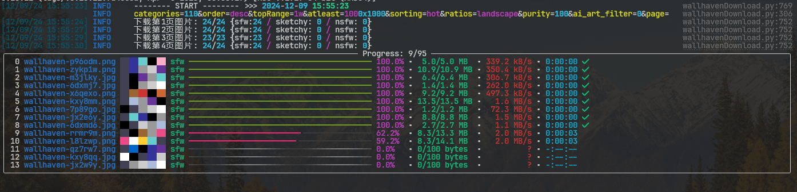

# wallhaven.cc

## Overview

This project is a wallpaper downloader for [wallhaven.cc](https://wallhaven.cc). It allows you to download wallpapers based on various filters and criteria using the Wallhaven API.

## Features

- Download wallpapers based on categories, purity, sorting, and other filters.
- Supports downloading multiple pages.
- Logs download progress and errors.
- Cleans up old files to maintain a specified number of wallpapers.

## Requirements

- Python 3.10+
- `aiofiles`
- `aiohttp`
- `asyncio`
- `requests`
- `rich`

## Installation and Usage

1. Clone the repository and cd into the directory.

### For Windows

1. Run `start.bat` and the venv environment will be auto-installed.

```shell
> cd wallpaper
> .\start.bat
```

2. You can also use some arguments to download wallpapers, `--help` for help.

```shell
> .\start.bat --categories 111 --purity 110
> .\start.bat --help
```



### For Linux/Mac

1. Install the requirements using `requirements.txt` and run the `wallhavenDownload.py`.

```shell
$ cd wallpaper
$ python -m venv venv
$ source venv/bin/activate
$ pip install -r requirements.txt
$ python wallhavenDownload.py
```

2. **OR** Use poetry installation environment and run the `wallhavenDownload.py`.

```shell
$ cd wallpaper
$ poetry install
$ poetry run python wallhavenDownload.py
```

## Configuration

Change the relevant parameters in `configs.py`, and it can be used normally without modification at all.

### `configs.py`:

```
# Fill in your APIKey
APIKey = ""
# Your API key can be used to grant other apps access to some of your account settings.
```

See: https://wallhaven.cc/settings/account

#### Customize the downloader:

- `api_key`: Your Wallhaven API key.
- `categories`: Categories to filter wallpapers.
- `purity`: Purity settings for wallpapers.
- `sorting`: Sorting order for wallpapers.
- `order`: Order of sorting.
- `topRange`: Range for top list sorting.
- `ratios`: Desired aspect ratios.
- `atleast`: Minimum resolution allowed.
- `maxPage`: Maximum pages to download.

Refer to the Wallhaven API documentation for more details on the available filters and settings.

See: https://wallhaven.cc/help/api#search
